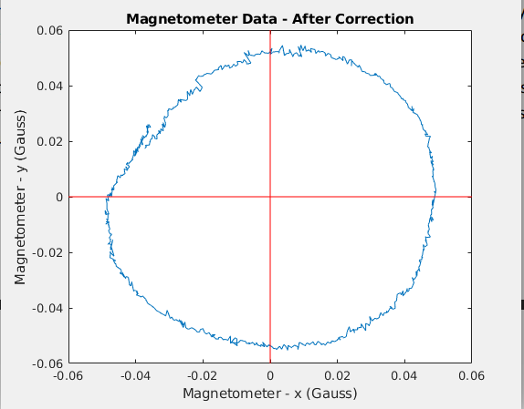
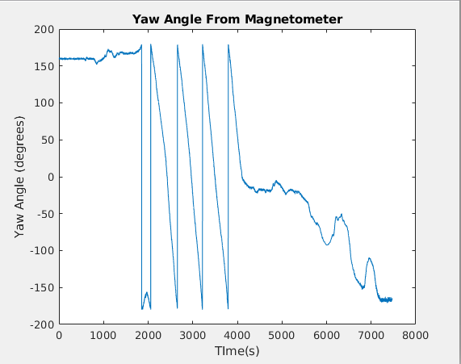
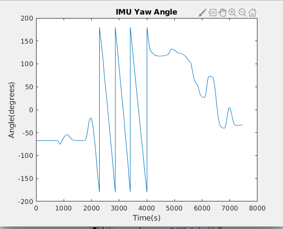
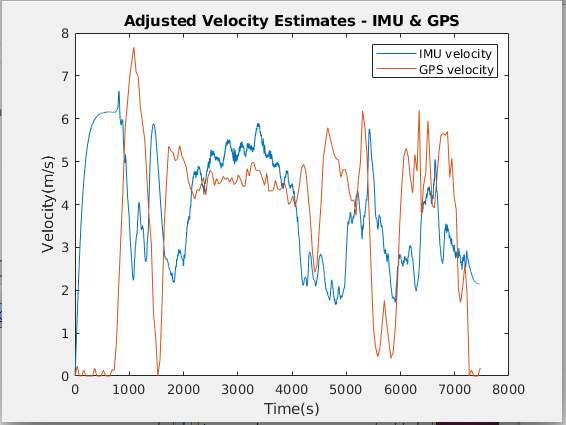
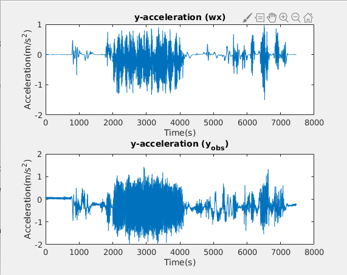
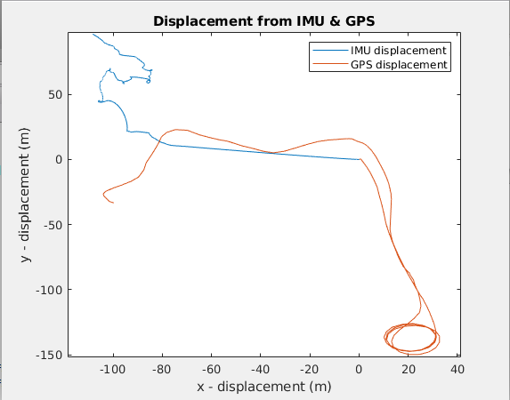

# imu_gps
Both a GPS and IMU were used while driving around the city to compare and better understand the role of each in navigation. The Accelerometers, Gyroscopes and Magnetometers on the IMU were used to determine the measure acceleration, heading(orientation) and magenetic field. Velocity and displacement were calculated by taking the integrating the measurements.

## Required 
* IMU
* GPS
* LCM

## Setup

#### Imu Setup 

As Sudo create a file under /etc/udev/rules.d called 50-VN-100.rules with the following:
```
KERNEL=="ttyUSB[0-9]*", ACTION=="add", ATTRS{idVendor}=="1d6b",
ATTRS{idProduct}=="0002", MODE="0666", GROUP="dialout"

ACTION=="add", SUBSYSTEM=="usb-serial", DRIVER=="ftdi_sio",
ATTR{latency_timer}="1"

sudo udevadm control --reload-rules && sudo service udev restart &&
sudo udevadm trigger
```

#### Device Driver Setup
```
Add the LCM typedef for the IMU in the ~/my_robot/lcmtypes directory
Add a device driver for the Vectornav IMU in the ~/my_robot directory
Make sure everything compiles correctly
Run your IMU device driver and test that it works by moving the IMU along
different axes
Now run both the GPS and the IMU simultaneously on your computer
```

## Results

#### Magnetometer Data:
 

#### Yaw Angle:
 

#### Estimated Velocity and Acceleration:
 

#### Estimated Displacement:

