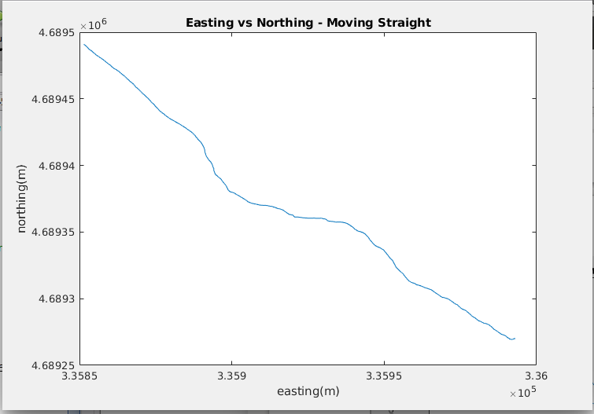

# imu_gps

### Required
* LCM
* GPS

### Installing LCM
download lcm-1.2.1    	

cd ~/lcm-1.2.1	      	# Goto the directory
sudo ./configure      	# note we will use sudo so that executables are installed properly
sudo make
sudo make install
sudo ldconfig

### LCM Setup
```
#/usr/bin/env bash
#sudo chmod 666 /dev/ttyUSB0
export CLASSPATH=$PWD

lcm-logger -s ./log/lcm-log-%F-%T &
lcm-spy & 

./imu_xsens /dev/ttyUSB0

kill %1 %2  # %3  %4 %5 %6 %7 %8 %9
```
### References
```
lcm-spy: https://linux.die.net/man/1/lcm-spy
lcm-gen: https://linux.die.net/man/1/lcm-gen
lcm-logger: https://linux.die.net/man/1/lcm-logger
lcm-logplayer: https://linux.die.net/man/1/lcm-logplayer
```

## Results

#### Straight path: 2D plot with distorton from nearby buildings:



#### Parking garage path: 3D plot with distorton from nearby buildings:

